**<u>Experiment 1</u>**

**<u>Introduction </u>**

The Common Source (CS) configuration is a type of MOSFET configuration
that is widely used as a voltage or power amplifier. The input ac small
signal is supplied to the gate (G) terminal, which has a high input
resistance, so as to not disturb the dc Q-point (quiescent operating
point) that the circuit has been biased with to produce necessary
amplification. The output is taken across the drain (D) terminal. The CS
amplifier is a transconductance amplifier, i.e., if we supply voltage
(V) as an input, we will obtain a current (I) as the output.

In this experiment, we have simulated a CS amplifier configuration,
without a source resistance Rₛ , and performed various analysis using
the LTSpice tool, a popular tool for designing, analysing a circuit’s
performance. We have made use of the TSMC 180 nm SPICE library (.lib)
file to set the parameters of our N-channel MOSFET (NMOS).

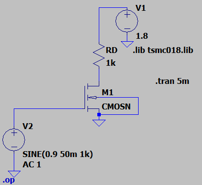For
this particular circuit, we have been given a power budget of 50 μW,
given the supply voltage of 1.8V, drain resistance (RD) =
1kΩ.

**<u>Procedure:</u>**

1.  Open the Ltspice software and click on new file.

2.  Then to get the required components, click on ‘components’ option to
    get the components.

3.  Select the nmos option and click on the required model.

4.  Then similarly select and place the other components from the
    ‘components’ option to form the required circuit.

5.  Next, click the .t icon on the toolbar. This lets you add a SPICE
    directive, which will allow you to specify the process technology
    and the parameters for the MOSFET. In this case, we will be using
    the **TSMC 180 nm process technology**.

6.  Before giving the SPICE directive, make sure to save the TSMC 180 nm
    SPICE netlist, or .lib file in the folder where you have saved
    LTSpice on your system.

7.  Next, using the .t tool, give the directive, **.lib tsmc018.lib**,
    and click ‘OK’. Then place this command anywhere in the schematic.

**DC op pnt**

**Procedure:**

1.  To check the operating point first calculate the Id value
    with the help of Vdd and the power budget mentioned in the question.

2.  Also, through KVL find the value of VD.

3.  Next verify it in Ltspice software and check if the value matches.

4.  Then since it is an amplifier check whether it is operating in the
    saturation region or not.

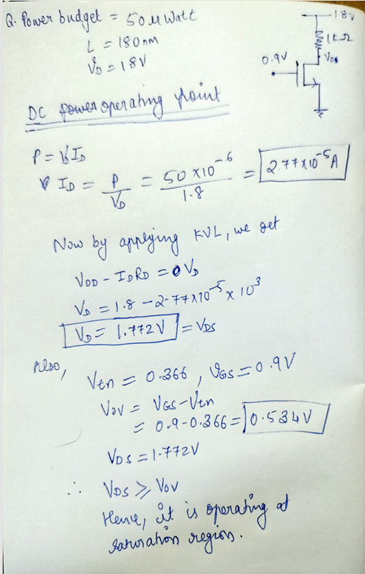**Calculations:**

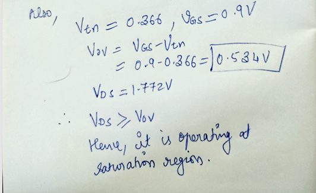

**Results:**

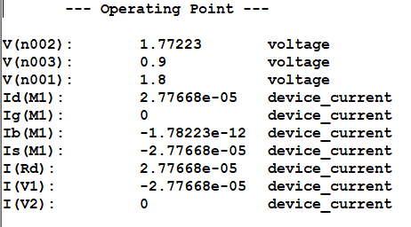

**Transient Analysis**

- For transient analysis, first we need to give the required frequency
  of 1KHz.

- Then ensure that it follows the condition for small signal analysis
  (Vgs\<\<2Vov).

- Then take the readings for 5 cycles by giving time period as 5ms).

- Type ‘.tran5m’ to give the time period.

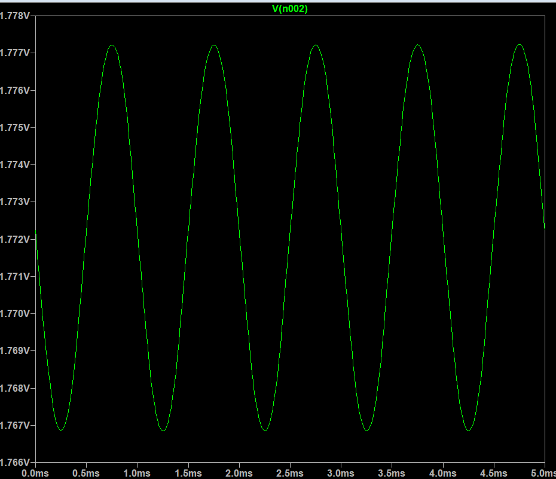**Result**

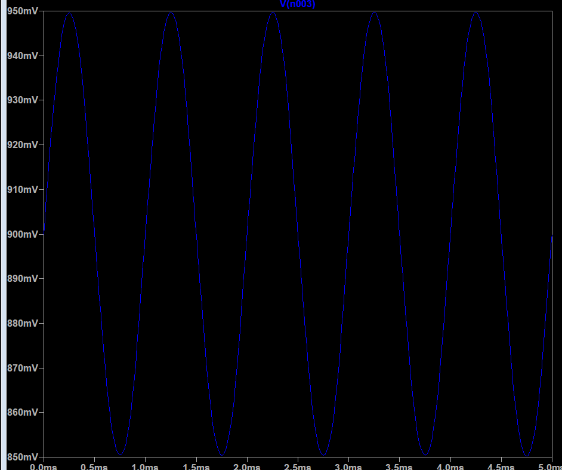**Input waveform:**

From here, we can calculate the voltage gain by using the formula
Av=Vout/Vin.

Therefore, the voltage gain is:

**Av = -( Vout/ Vin) = -(1.777/50m) =
-35.54**

**AC Analysis**

Next, we can perform the AC analysis, this can be done by clicking on
‘configure analysis’ and then clicking on the ‘AC analysis’ tab.

Now give the required parameters and place the directive near the
circuit.

For this circuit give the following parameters:

For our analysis, choose “Type of Sweep” = Decade, so that the plot of
gain will be dB/decade, and the number of points per decade = 20. Set
start frequency = 0.1 Hz, end frequency = 1 THz, which gives us a large
range of frequency to find results.

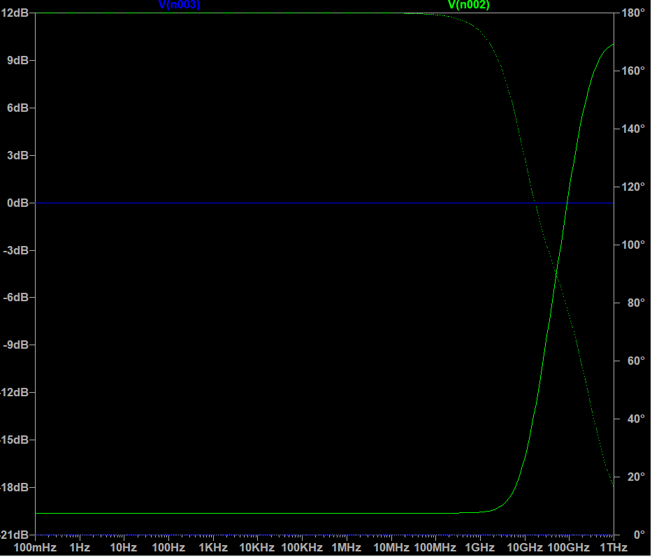**Result:**

The midband gain is around -15 dB, for an input ac sine signal, of
amplitude 50 mV. The gain is negative due to a 180° phase shift, which
inverts the output compared to the input.

Converting our gain from V/V to dB, using the formula A’V =
-10log10(Av)

**A’V = -10log10(35.54) = -10(1.5507) = -15.507**

Also, the gain begins falling at around 1 GHz and so this will
approximately be the fH of the amplifier.

**DC Sweep**

**Transfer characteristics**

The next analysis we can perform is the AC analysis, to compute the
small signal AC behaviour of the circuit, and calculate the midband and
find breaking frequencies, i.e., fL, fH.

The resultant graph gives us the Bode plot of the circuit’s behaviour,
which is the variation of gain over frequency, and also the variation of
phase over frequency, in one plot.

For this circuit we should choose, “Type of Sweep” = Decade, so that the
plot of gain will be dB/decade, and the number of points per decade =
20. Set start frequency = 0.1 Hz, end frequency = 1 THz, which gives us
a large range of frequency to find results.

Place the **“.ac dec 20 0.1 1T”** directive anywhere on the schematic
and click Run.

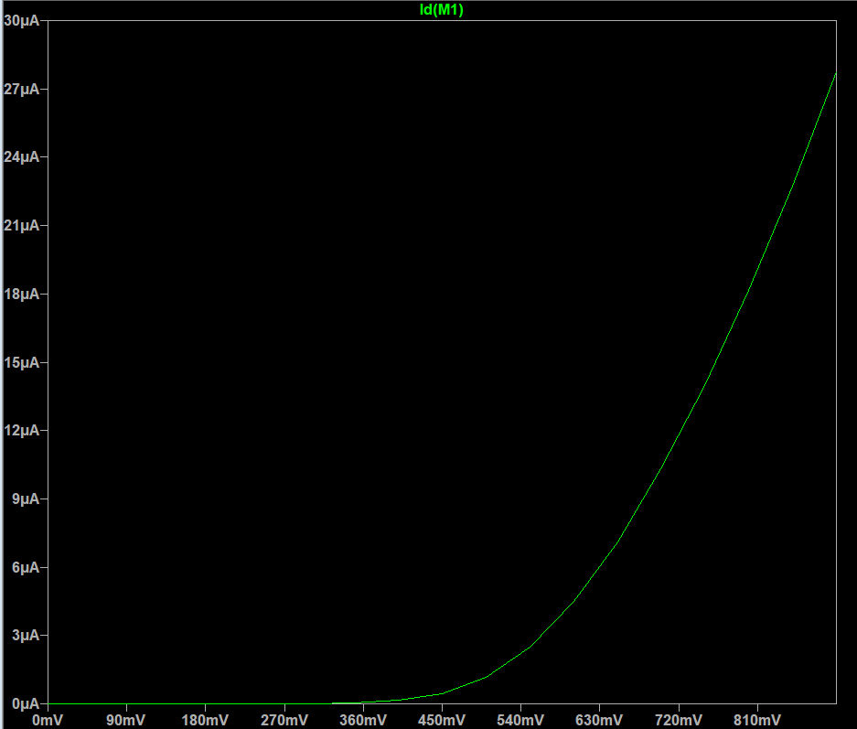**Result**

The voltage at which the current starts flowing through the MOSFET is
around 360 mV = 0.36 V ≈ 0.3662473 V, which is the NMOS threshold
voltage (Vt) from the tsmc018.lib file.

**Drain characteristics**

To perform the DC sweep on VDS, and obtain drain
characteristics, we go to the “Configure Analysis” option and choose the
DC sweep tab, and input the parameters. For this analysis, set the name
of 1st source to sweep = VDD, the type of sweep =
Linear, start value = 0V, stop value = 1.8V, which is the maximum value
of the input gate voltage, increment = 0.1V.

Place the **“.dc VDD 0 1.8
0.1”** directive anywhere on the schematic, and then click on the “Run”
icon.

From this graph, we can see that the saturation region starts at around
0.4V and the maximum current reaches to 27.7uA.

**Varying different parameters**

**1.Variying RD value**

Using the SPICE directive, type **“.step param R 10 1k 50”**, which
tells LTSpice to vary R from 10Ω to 1kΩ, in steps of 50Ω.

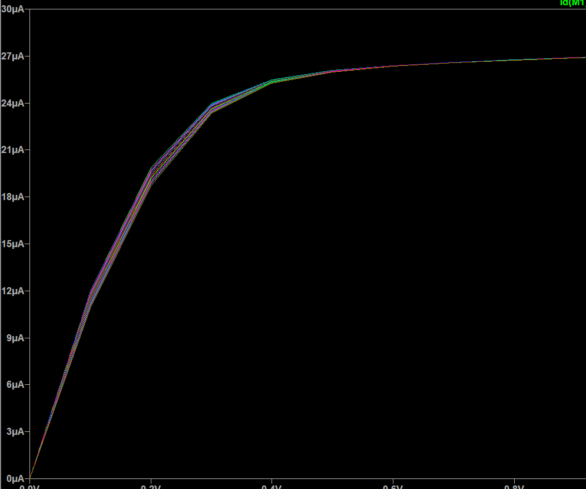

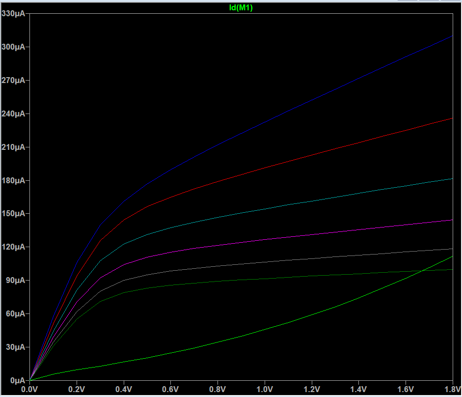**2.Varying L**

Use the directive “.step param l 50n 200n 25n” to get the graph for
values of L from 50nm to 200nm with an increment of 25nm.

**3.Variying W**

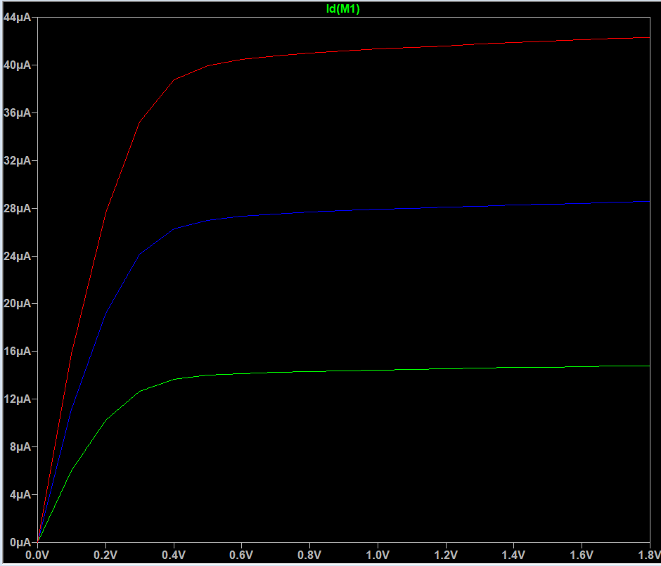Using the SPICE directive,
type **“.step param w 0.5u 1.5u 0.5u”**, which tells LTSpice to vary W
from 0.5 µm to 1.5 µm in steps of 0.5 µm.
