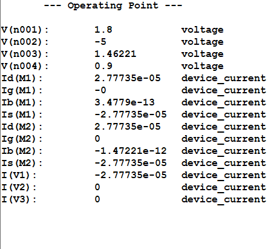
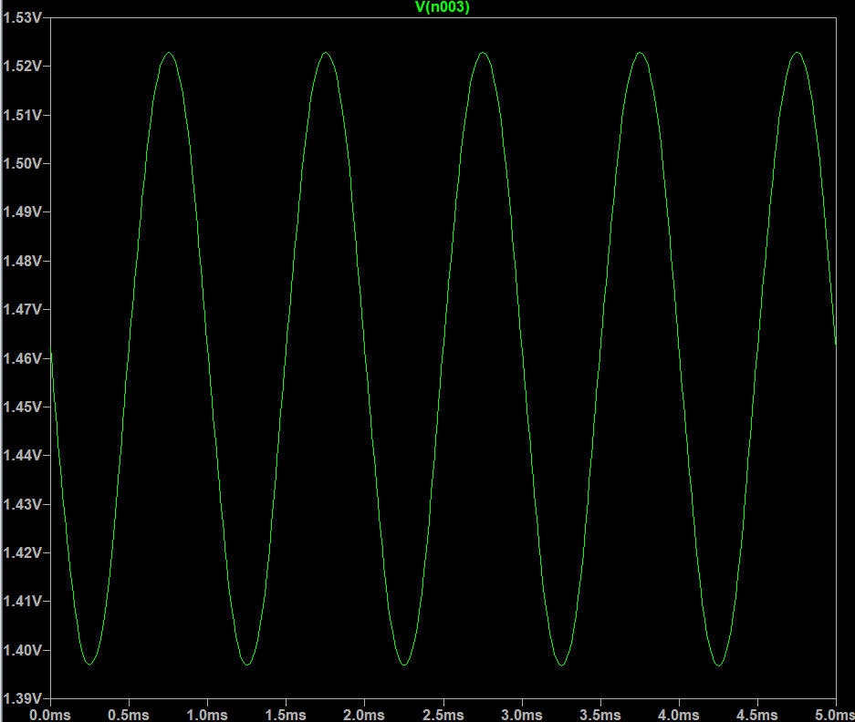

**<u>Experiment_Part_2</u>**

**Introduction**

An amplifier that uses both
PMOS and NMOS transistors is called a CMOS amplifier (Complementary
Metal Oxide Semiconductor amplifier), where the combination of both
types of transistors allows for improved performance by utilizing their
complementary characteristics, often resulting in better power
efficiency and reduced distortion compared to using only one type of
MOSFET. 

**<u>DC Operation Point</u>**

**Procedure:**

1.  To check the operating point first calculate the Id value
    with the help of VDD and the power budget mentioned in
    the question.

2.  From the part 1 of this experiment, we can say that the current ID
    must be around 27.7 uA.

3.  So through trail and error we should fill the values of W,L for the
    PMOS and then by calculation, we can write the maximum required VG
    value.

4.  In this case the maximum required value for VG must be less than
    1.4V.

5.  Here we take the value of VG is -5V.

**Transient Analysis**

- For transient analysis, first we need to give the required frequency
  of 1KHz.

- Then ensure that it follows the condition for small signal analysis
  (Vgs\<\<2Vov).

- Then take the readings for 5 cycles by giving time period as 5ms).

- Type ‘.tran5m’ to give the time period.

**Output waveform**

**Input waveform**

Therefore, the voltage gain is:

**Av = -( Vout/ Vin) = -(1.554/50m) =
-31.1**

**AC Analysis**

Next, we can perform the AC analysis, this can be done by clicking on
‘configure analysis’ and then clicking on the ‘AC analysis’ tab.

Now give the required parameters and place the directive near the
circuit.

For this circuit give the following parameters:

For our analysis, choose “Type of Sweep” = Decade, so that the plot of
gain will be dB/decade, and the number of points per decade = 20. Set
start frequency = 0.1 Hz, end frequency = 1 THz, which gives us a large
range of frequency to find results.

Converting our gain from V/V to dB, using the formula A’V =
-10log10(Av)

**A’V = -10log10(31.1) = -10(1.5507) = -14.92**

**DC Sweep**

**Transfer characteristics**

The next analysis we can perform is the AC analysis, to compute the
small signal AC behaviour of the circuit, and calculate the midband and
find breaking frequencies, i.e., fL, fH.

The resultant graph gives us the Bode plot of the circuit’s behaviour,
which is the variation of gain over frequency, and also the variation of
phase over frequency, in one plot.

For this circuit we should choose, “Type of Sweep” = Decade, so that the
plot of gain will be dB/decade, and the number of points per decade =
20. Set start frequency = 0.1 Hz, end frequency = 1 THz, which gives us
a large range of frequency to find results.

Place
the **“.ac dec 20 0.1 1T”** directive anywhere on the schematic and
click Run.

**Drain characteristics**

To perform the DC sweep on VDS, and obtain drain
characteristics, we go to the “Configure Analysis” option and choose the
DC sweep tab, and input the parameters. For this analysis, set the name
of 1st source to sweep = VDD, the type of sweep =
Linear, start value = 0V, stop value = 1.8V, which is the maximum value
of the input gate voltage, increment = 0.1V.Place the **“.dc VDD 0 1.8
0.1”** directive anywhere on the schematic, and then click on the “Run”
icon.

From this graph, we can see that the saturation region starts at around
0.4V and the maximum current reaches to 27.7uA.

**<u>Inference</u>**

From this experiment, we understand the behavior of the MOSFET using
various analyses, such as DC analysis, transient analysis, DC sweep, AC
analysis. The results of our analysis prove that the MOSFET is a voltage
controlled current device, since changing the values of input value
VGS changes the values of output current.

We can also when we perform AC analysis, the MOSFET amplifies input
signal, from 50 mV, to 1.77 V, giving a gain of -35.54, due to a 180°
phase shift, causing output to be inverted compared to output. The AC
analysis results give us a gain of -15 dB, with a phase shift of almost
180°.

Next, we saw the variation of drain current due to W, L parameters of
the MOSFET. We also saw the variation of ID, with
R1, i.e., RD value.

Finally, we learnt how to use the LTSpice simulation tool, which
provides an easy way to simulate and test circuits, while maintaining
process parameters that would be used during fabrication, via SPICE
directives, .lib files.
